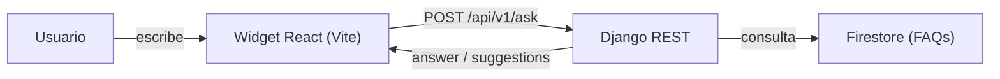

# Mini Chatbot — React + Django REST + Firestore

Widget de chat **embebible** (flotante) que responde **Preguntas Frecuentes (FAQ)** usando un backend en **Django REST** y datos en **Firebase/Firestore**.  
Cuando no encuentra una respuesta exacta, ofrece **sugerencias** (chips clicables) para guiar al usuario.

> **Highlights**
>
> - ✅ Botón flotante (FAB) que abre/cierra el chat
> - ✅ UX cuidada: sugerencias si no entiende, “typing” y autoscroll
> - ✅ Resetea la conversación al cerrar el widget
> - ✅ Configurable desde el front (color de marca, saludo, icono, etc.)
> - ✅ Sin LLMs ni servicios de terceros prohibidos: **solo Django + Firestore**
> - ✅ Seguridad práctica: `.env`, CORS, y push protection de secretos

---

## Tabla de contenidos

- [Requisitos](#requisitos)
- [Estructura del repo](#estructura-del-repo)
- [Puesta en marcha (dev)](#puesta-en-marcha-dev)
  - [Backend (Django)](#backend-django)
  - [Frontend (Vite/React)](#frontend-vitereact)
- [Uso rápido](#uso-rápido)
- [Contrato de API](#contrato-de-api)
- [Arquitectura y diseño](#arquitectura-y-diseño)
  - [Diagrama](#diagrama)
  - [Cómo “entiende” el bot](#cómo-entiende-el-bot)
  - [Por qué estas tecnologías](#por-qué-estas-tecnologías)
- [Configuración](#configuración)
  - [Variables de entorno (backend)](#variables-de-entorno-backend)
  - [Variables de entorno (frontend)](#variables-de-entorno-frontend)
  - [Cargar FAQs en Firestore](#cargar-faqs-en-firestore)
- [Personalización del widget](#personalización-del-widget)
- [Build y despliegue](#build-y-despliegue)
- [Solución de problemas](#solución-de-problemas)
- [Licencia](#licencia)

---

## Requisitos

- **Python 3.11+**
- **Node 18+** (o 20 LTS)
- **pip** y **venv**
- Proyecto de **Firebase** con **Firestore** habilitado y credencial de **Service Account** (JSON)

---

## Estructura del repo

> Actualizado según las carpetas reales en las capturas.

```
mini_chatbot/
├─ backend/
│  ├─ app/                          # Proyecto Django
│  │  ├─ core/                      # App principal
│  │  │  ├─ management/commands/
│  │  │  │  └─ seed_faqs.py         # (opcional) comando para precargar FAQs
│  │  │  └─ migrations/             # migraciones de Django
│  │  ├─ services/                  # capa de servicios
│  │  │  ├─ firestore_repo.py       # CRUD/lecturas contra Firestore
│  │  │  └─ search_engine.py        # normalización + matching difuso
│  │  ├─ views_admin.py             # vistas administrativas (si aplica)
│  │  ├─ views_public.py            # endpoint público /api/v1/ask
│  │  ├─ serializers.py             # serializers/validador de request
│  │  ├─ auth.py                    # utilidades de auth (token opcional)
│  │  ├─ urls.py                    # rutas de la app core
│  │  ├─ apps.py                    # config app
│  │  ├─ asgi.py
│  │  ├─ settings.py
│  │  ├─ urls.py                    # rutas del proyecto -> incluye core.urls
│  │  └─ wsgi.py
│  ├─ secure/                       # NUNCA commitear
│  │  ├─ firebase-key.json          # Service Account de Firebase
│  │  └─ .env                       # variables del backend (dev/prod)
│  ├─ db.sqlite3                    # base local para admin/sesiones (dev)
│  ├─ manage.py
│  └─ requirements.txt
└─ frontend/
   ├─ public/
   │  └─ assets/
   │     └─ Mini-Chatbot.png
   ├─ src/
   │  ├─ components/
   │  │  ├─ ChatWidget.jsx
   │  │  └─ ChatWidget.css
   │  ├─ App.jsx
   │  ├─ App.css
   │  └─ main.jsx
   ├─ .env
   ├─ index.html
   ├─ vite.config.js
   ├─ package.json
   └─ package-lock.json
```

---

## Puesta en marcha (dev)

### Backend (Django)

1) Preparar entorno e instalar dependencias:
```bash
cd backend
python -m venv .venv
# Windows: .venv\Scripts\activate
# macOS/Linux:
source .venv/bin/activate

pip install -r requirements.txt
```

2) Variables de entorno (ver [Configuración](#variables-de-entorno-backend)).

3) Migraciones y runserver:
```bash
python manage.py migrate
python manage.py runserver 127.0.0.1:8000
```

- Endpoint principal: `POST http://127.0.0.1:8000/api/v1/ask/`

---

### Frontend (Vite/React)

1) Variables de entorno (ver [Configuración](#variables-de-entorno-frontend)).

2) Instalar y correr:
```bash
cd frontend
npm ci
npm run dev
```

3) Abrir `http://localhost:5173`.  
Haz clic en el **botón flotante** (FAB) para abrir el chat.

---

## Uso rápido

- Escribe una pregunta **que exista** en tu colección `faqs` (Firestore) → el bot responde el `answer`.
- Escribe una pregunta **ambigua/inesperada** → responde “Quizá te interese:” y muestra **sugerencias** (chips) para clicar.
- Cierra el chat con ✕ → el widget **reinicia** la conversación (saludo + sugerencias iniciales, si las definiste).

---

## Contrato de API

### `POST /api/v1/ask/`

**Request**
```json
{ "message": "texto de la consulta" }
```

**Response — caso conocido**
```json
{ "answer": "contenido de la respuesta exacta" }
```

**Response — no entendido (con sugerencias)**
```json
{
  "status": "not_understood",
  "suggestions": ["Pregunta A", "Pregunta B", "Pregunta C"],
  "matches": [
    { "question": "Pregunta similar 1", "score": 0.82 },
    { "question": "Pregunta similar 2", "score": 0.73 }
  ]
}
```

> El frontend formatea este segundo caso como **chips clicables**.

---

## Arquitectura y diseño

### Diagrama



### Cómo “entiende” el bot

1. Normaliza y compara la consulta contra las **FAQs** en Firestore (búsqueda por similitud + coincidencia exacta).
2. Si hay **match** suficiente → devuelve `answer`.
3. Si el match es bajo o nulo → devuelve `status: not_understood` + **sugerencias** (mezcla `suggestions` + `matches`).
4. El **front** pinta las sugerencias como “chips” y permite reenviar con un clic.

### Por qué estas tecnologías

- **Django REST**: rápido de levantar, robusto, claro para un desarrollo escalable.
- **Firestore**: NoSQL administrado; alta disponibilidad; CRUD sencillo para FAQs.
- **Vite + React**: DX excelente y **widget** embebible y temable.

---

## Configuración

### Variables de entorno (backend)

Crea `backend/secure/.env` (o `backend/.env` si prefieres), y **no lo subas al repo**:

```env
# Django
DJANGO_SECRET_KEY=pon-un-secreto-largo-y-unico
DEBUG=1
ALLOWED_HOSTS=127.0.0.1,localhost

# CORS: en dev puedes permitir el front local
CORS_ALLOWED_ORIGINS=http://localhost:5173

# Header opcional si quieres validar un token por request
API_ADMIN_TOKEN=tokensito-opcional

# Firebase (Service Account)
# Ruta local al JSON de la cuenta de servicio
GOOGLE_APPLICATION_CREDENTIALS=./secure/firebase-key.json
```

> Asegúrate de **NO** commitear `.env` ni el JSON —déjalos ignorados por git dentro de `backend/secure/`.

---

### Variables de entorno (frontend)

Crea `frontend/.env`:

```env
VITE_API_BASE_URL=http://127.0.0.1:8000
VITE_API_PATH=/api/v1/ask/

# Opcional
# VITE_API_ADMIN_TOKEN=...
# VITE_CHAT_ICON=/assets/Mini-Chatbot.png
```

---

### Cargar FAQs en Firestore

Colección: **`faqs`**  
Documento (campos mínimos):

```json
{
  "question": "¿Cuál es la política de reembolso?",
  "answer": "Puedes solicitar reembolso dentro de X días...",
  "tags": ["pagos","reembolsos"]
}
```

Formas de carga:
- Consola de **Firebase** → Firestore → Agregar documento.
- (Si está disponible) comando `python manage.py seed_faqs` para precargar ejemplos.

---

## Personalización del widget

En `frontend/src/components/ChatWidget.jsx`:

- `brandColor="#111827"` — color de marca (afecta FAB, header, botón enviar).
- `assistantAvatar="/assets/Mini-Chatbot.png"` — avatar en el header del chat.
- `welcome="¡Hola! ¿En qué puedo ayudarte?"` — mensaje inicial.
- `initialOpen={false}` — abre el chat al cargar si lo pones en `true`.
- `initialSuggestions={[...]}` — chips iniciales (máximo 10 recomendado).

CSS en `ChatWidget.css` (clases: `.chat-fab`, `.chat-panel`, `.msg-bubble`, etc.).

---

## Build y despliegue

**Frontend (Vercel/Netlify):**
```bash
cd frontend
npm run build
# sube la carpeta dist/ a tu hosting (o conecta el repo)
```
- Configura `VITE_API_BASE_URL` apuntando al backend público.
- Si usas Vercel, el front se puede desplegar como sitio estático fácilmente.

**Backend (Render/Fly/VM propia):**
- Define `DEBUG=0`, `ALLOWED_HOSTS` con tu dominio/IP y `CORS_ALLOWED_ORIGINS` con el dominio del front.
- Mantén `GOOGLE_APPLICATION_CREDENTIALS` apuntando al **path en el servidor** del JSON de Service Account.
- Usa `gunicorn` + `whitenoise` (o nginx) para producción.

---

## Solución de problemas

- **Mermaid no renderiza el diagrama** → verifica que el bloque tenga ```mermaid y que los textos de arista estén entre `|...|`.
- **CORS bloquea el request** → revisa `CORS_ALLOWED_ORIGINS` en el backend y que el front use la URL correcta en `.env`.
- **404 en `/api/v1/ask/`** → confirma que `app/urls.py` incluya la ruta y que el `project urls.py` incluya `core.urls`.
- **Permisos de Firestore** → en desarrollo puedes usar reglas abiertas temporalmente; en producción restringe por IP o tokens.
- **Credenciales Firebase** → el path en `GOOGLE_APPLICATION_CREDENTIALS` debe existir en el servidor y ser legible por el proceso.

---

## Licencia

MIT.

---

**© 2025 Cristofer Barrios Valverde — Todos los derechos reservados.**
